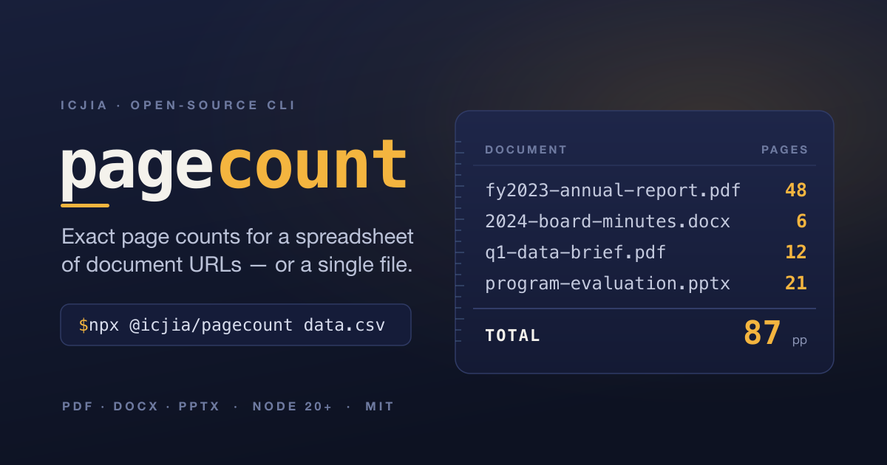

<div align="center">



<br><br>

<strong>Exact page counts for a spreadsheet of document URLs — or a single file, from the command line.</strong>

<br><br>

<a href="https://www.npmjs.com/package/@icjia/pagecount"></a>
<a href="https://nodejs.org"></a>
<a href="https://www.typescriptlang.org"></a>
<a href="#development"></a>
<a href="LICENSE"></a>

</div>

# pagecount

`pagecount` is a command-line tool with two modes, chosen automatically by what you give it:

- **Spreadsheet mode** — given a CSV or XLSX with a column of public document URLs
  (PDF, DOCX, PPTX), it reads each file, counts its pages, and writes the spreadsheet
  with `programmatic_page_count` + `programmatic_page_count_notes` columns appended —
  as both a `.csv` and an `.xlsx`.
- **Document mode** — given a single document (a local file or a URL), it prints the
  page count and exits, writing nothing.

It is published on npm as [`@icjia/pagecount`](https://www.npmjs.com/package/@icjia/pagecount) —
implemented, tested, and security-hardened (149 passing tests; see the
[red-team / blue-team audit](#security--red-team--blue-team-audit)).

## Contents

- [Quick start](#quick-start)
- [Requirements](#requirements)
- [Install](#install)
- [Usage](#usage) — [spreadsheet mode](#spreadsheet-mode) · [document mode](#document-mode) · [filtering rows](#filtering-rows-remediation)
- [CLI reference](#cli-reference) — [recipes by flag](#recipes--examples-by-flag)
- [User stories](#user-stories)
- [How page counts are determined](#how-page-counts-are-determined)
- [Output & errors](#output--errors-spreadsheet-mode)
- [Security — red-team / blue-team audit](#security--red-team--blue-team-audit)
- [Development](#development)
- [License](#license)

## Quick start

No install required — run it straight from npm with `npx`:

```bash
# count one document (prints "report.pdf · pdf · 12 pages")
npx @icjia/pagecount report.pdf

# count a document on the web (nothing is written to disk)
npx @icjia/pagecount https://example.org/report.pdf

# process a spreadsheet of URLs → writes a counted .csv + .xlsx beside it
npx @icjia/pagecount data.csv
```

The first `npx` run downloads the package; add `-y` (`npx -y @icjia/pagecount …`) to skip
the install prompt in scripts. Counting documents many times a day? [Install it
globally](#install) so each call is instant.

## Requirements

- **Node.js 20+** (uses the built-in `fetch`).
- **LibreOffice** *(optional)* — only needed to compute exact page counts for DOCX
  files that don't carry cached page metadata. See [DOCX page counts](#docx-page-counts).
- **poppler** (`pdfinfo`) *(optional)* — fallback for counting encrypted or unusual
  PDFs the built-in parser can't read. `brew install poppler`.

## Install

**Run without installing** (best for occasional use — always runs the latest version):

```bash
npx @icjia/pagecount data.csv
```

**Install globally** (best for frequent use — no per-run download):

```bash
npm i -g @icjia/pagecount
npm i -g github:ICJIA/pagecount            # or straight from GitHub (builds on install)
pagecount data.csv                          # now on your PATH
```

**From a clone (for development):**

```bash
git clone https://github.com/ICJIA/pagecount.git
cd pagecount
npm install
npm run build
npm link          # puts `pagecount` on your PATH, pointing at your working copy
```

## Usage

### Spreadsheet mode

```bash
pagecount data.csv
```

Reads `./data.csv`, finds the column of document URLs (preferring links to actual
pdf/docx/pptx files), counts pages, and writes:

```
./.pagecount-output/data-pagecount.csv
./.pagecount-output/data-pagecount.xlsx
```

The output is the original spreadsheet with **two columns appended at the far right**:
`programmatic_page_count` (the count) and `programmatic_page_count_notes` (why a row is
blank — e.g. `corrupt`, `unsupported`, `no-url`, `skipped (filtered out)`). They're always added, even if the
sheet already has a "Page Count" column. **Both a `.csv` and an `.xlsx` version are written every run.** The `.pagecount-output` directory is created
beside the input file (and reused if it already exists). The same works for `.xlsx`,
preserving the workbook's formatting and any extra sheets.

Multiple files and globs — each writes to its own `.pagecount-output` beside it:

```bash
pagecount *.csv
pagecount survey.csv ../reports/q3.xlsx
```

See [`samples/example.csv`](samples/example.csv) for the expected input shape — a
column of public document URLs (swap in your own URLs to try it).

### Document mode

Check a single file or URL without touching a spreadsheet:

```bash
pagecount report.pdf
# report.pdf · pdf · 12 pages

pagecount slides.pptx -q
# 12

pagecount https://example.org/a.pdf --json
# {"file":"https://example.org/a.pdf","type":"pdf","pageCount":8,"status":"ok"}
```

Nothing is written to disk. Exits non-zero if the file can't be counted, so it composes
in scripts:

```bash
if [ "$(pagecount -q narrative.pdf)" -gt 15 ]; then
  echo "narrative.pdf exceeds the 15-page limit"
fi
```

### Filtering rows (remediation)

By default, spreadsheet mode counts pages only for rows whose **`Recommendation`** column
equals **`remediate`** (case-insensitive). This gives remediation vendors a single number
per site: the TOTAL row sums just the pages marked for remediation. Non-matching rows are
kept in place with a blank `programmatic_page_count` and `skipped (filtered out)` in the
notes column — and are never downloaded.

```bash
pagecount "samples/ICJIA R&A publications-as of 2026-05-29(DVFR).csv"
```

- Different column or values:
  `pagecount data.csv --filter-column Action --filter-value fix,review`
- Count **every** row (e.g. a sheet with no disposition column, or when you want all of
  them): `pagecount data.csv --no-filter`

If a sheet has no `Recommendation` column and you didn't pass `--filter-column`,
`pagecount` prints a one-line notice and counts every row.

## CLI reference

```
pagecount [options] <input...>
```

`<input>` is one or more spreadsheets (`.csv`/`.xlsx`) and/or documents
(`.pdf`/`.docx`/`.pptx` or an `http(s)` URL). Mode is chosen per argument.

| Option | Description | Default |
|---|---|---|
| `-o, --output <dir>` | (spreadsheet) force one shared output dir | `.pagecount-output` beside each file |
| `-c, --column <name\|index>` | (spreadsheet) URL column, by header name or 1-based index | auto-detect (prefers document links) |
| `--count-column <name>` | (spreadsheet) count column name (a `<name>_notes` column is added too) | `programmatic_page_count` |
| `--filter-column <name\|index>` | (spreadsheet) only count rows matching `--filter-value`; name or 1-based index | `Recommendation` |
| `--filter-value <values>` | (spreadsheet) comma-separated value(s) to match (exact, case-insensitive) | `remediate` |
| `--no-filter` | (spreadsheet) count every row, ignoring the default filter | off |
| `--suffix <text>` | (spreadsheet) output filename suffix; `""` to disable | `pagecount` |
| `--json` | emit JSON (sidecar file in spreadsheet mode; stdout in document mode) | off |
| `-q, --quiet` | (document) print only the bare page number | off |
| `--concurrency <n>` | parallel downloads per spreadsheet (capped at 64) | `8` |
| `--timeout <sec>` | per-URL fetch timeout | `30` |
| `--max-size <mb>` | skip files larger than this | `100` |
| `--docx-render` | force LibreOffice render for DOCX | auto when available |
| `--allow-private-hosts` | allow fetching loopback/private/link-local hosts | off (blocked for SSRF safety) |
| `-h, --help` | show help | |
| `-V, --version` | show version | |

### Recipes — examples by flag

```bash
# pick the URL column explicitly (by header name or 1-based index)
pagecount data.csv -c "File URL"
pagecount data.csv -c 4

# rename the appended count column (a <name>_notes column is added alongside)
pagecount data.csv --count-column pages

# filter on a different column / values (exact, case-insensitive, comma = OR)
pagecount data.csv --filter-column Action --filter-value fix,review

# count every row, ignoring the default Recommendation=remediate filter
pagecount data.csv --no-filter

# write every output into one shared folder instead of beside each file
pagecount *.csv -o ./out

# change or drop the "-pagecount" filename suffix
pagecount data.csv --suffix counts     # → data-counts.csv / .xlsx
pagecount data.csv --suffix ""         # → data.csv / .xlsx (no suffix)

# emit JSON (sidecar file for spreadsheets; stdout for a single document)
pagecount data.csv --json
pagecount report.pdf --json | jq .pageCount

# document mode: just the number
pagecount report.pdf -q

# tune the network for big runs
pagecount big.csv --concurrency 16 --timeout 60 --max-size 250

# force a LibreOffice render for DOCX (exact count even when metadata is present)
pagecount data.csv --docx-render

# allow internal/loopback hosts — off by default for SSRF safety; trusted inputs only
pagecount internal.csv --allow-private-hosts
```

## User stories

Real ways people put `pagecount` on their PATH and wire it into a shell. Each adds the
alias to `~/.zshrc` (zsh) or `~/.bashrc` (bash) — `source` the file or open a new shell
after editing.

### 1. The accessibility remediation vendor

> *"A state agency sent me a 1,400-row audit export. I bid remediation by the page, and I
> need the total pages of just the documents flagged `remediate` — not the whole library."*

```bash
# ~/.zshrc — count only the pages an audit export marks for remediation
alias remediate-pages='npx -y @icjia/pagecount'
```

```bash
remediate-pages "Publications audit 2026-05-29.csv"
#   …-pagecount.csv  →  150 rows · 14 counted · 132 filtered · 3 no-url · 1 failed · 318 total pages
```

**Why:** the built-in `Recommendation = remediate` filter means the TOTAL row is exactly
the billable scope — measured from the real source files, not estimated. Every excluded
row is visibly marked `skipped (filtered out)`, so the agency can see what you did and
didn't count. (Pairs with the kind of CSV a tool like SiteImprove exports.)

### 2. The records clerk who just needs "how many pages?"

> *"Before I print, redact, or charge for copies, I want a page count — for a local file
> or a link someone emailed me — without opening Acrobat."*

```bash
# ~/.bashrc — print just the number, for a path or a URL
alias pages='npx -y @icjia/pagecount -q'
```

```bash
pages annual-report.pdf            # 48
pages https://example.org/doc.pdf  # 8
```

**Why:** `-q` prints the bare number so it drops straight into scripts and pipelines, and
document mode counts a URL without downloading anything you have to clean up afterward.

### 3. The grants administrator enforcing a page limit

> *"Narrative attachments must be 15 pages or fewer. I want to flag the over-limit PDFs in
> a submissions folder before a human reviews them."*

```bash
# ~/.zshrc — pass/fail a single PDF against a page limit
check-limit() { [ "$(npx -y @icjia/pagecount -q "$1")" -le 15 ] && echo "OK   $1" || echo "OVER $1"; }
```

```bash
for f in submissions/*.pdf; do check-limit "$f"; done
# OK   submissions/applicant-01.pdf
# OVER submissions/applicant-02.pdf
```

**Why:** an exact count plus a non-zero exit on failure turns a manual page-by-page check
into a one-line gate.

### 4. The archivist building a catalog

> *"I have an XLSX inventory of our digital collection with a 'File URL' column. I want a
> page count beside every item — and I need to keep the workbook's formatting and tabs."*

```bash
# ~/.zshrc — catalog every row, ignoring the remediation filter
alias inventory='npx -y @icjia/pagecount --no-filter'
```

```bash
inventory collection.xlsx
# writes .pagecount-output/collection-pagecount.xlsx (+ .csv)
```

**Why:** `--no-filter` counts all rows; XLSX mode appends to a copy of the original
workbook so cell formatting and extra sheets survive, and you still get a plain `.csv` for
downstream tools.

### 5. The developer wiring it into CI

> *"A nightly job pulls a published spreadsheet of report URLs. I want machine-readable
> output and a clear failure signal when a document can't be counted."*

```bash
# ~/.zshrc — JSON in, jq out
pagesum() { npx -y @icjia/pagecount --json "$@"; }
```

```bash
pagesum docs.csv >/dev/null
jq '.summary | {counted, failed, totalPages}' .pagecount-output/docs-pagecount.json
# { "counted": 142, "failed": 1, "totalPages": 5120 }
```

**Why:** `--json` gives a stable schema (a sidecar file for spreadsheets, stdout for a
single document), the process exits non-zero on a failed document, and
`--concurrency` / `--timeout` / `--max-size` keep big runs predictable on a CI box. For a
pinned, network-free CI install, drop `npx` and use `npm i -g @icjia/pagecount@0.2.3`.

> **`npx` vs. global install.** `npx -y` always fetches the latest published version —
> great for occasional or always-current use. If you call `pagecount` constantly, a global
> install (`npm i -g @icjia/pagecount`) removes the per-run download; alias the installed
> binary instead, e.g. `alias pages='pagecount -q'`.

## How page counts are determined

| Type | Method | Exact? |
|---|---|---|
| **PDF** | read from the file (with a `pdfinfo`/poppler fallback for encrypted/unusual PDFs) | ✅ yes |
| **PPTX** | slide count from `presentation.xml` | ✅ yes |
| **DOCX** | see below | ⚠️ depends |

### DOCX page counts

A `.docx` file has **no intrinsic page count** — pagination only exists once the
document is rendered (by Word, LibreOffice, etc.) and depends on fonts, margins, and
page size. `pagecount` handles DOCX in two ways:

1. **Cached metadata (default):** Word and most editors store a `<Pages>` value in the
   file when they save. `pagecount` reads it directly — fast, no extra tools.
2. **Render fallback:** if that value is missing and **LibreOffice** is installed (or
   you pass `--docx-render`), `pagecount` renders the document to PDF and counts the
   pages — the authoritative count.

If a DOCX has no cached value and LibreOffice isn't available, its
`programmatic_page_count` is left blank (spreadsheet mode) or reported as an error
(document mode). Counted DOCX rows are flagged as an estimate in the notes column —
pagination depends on fonts and margins.

## Output & errors (spreadsheet mode)

- Rows without a full `http(s)` URL get a **blank** `programmatic_page_count` and
  `no-url` in `programmatic_page_count_notes`.
- Rows whose URL fails (404, timeout, unsupported/corrupt file, encrypted PDF) also get
  a blank count, with the reason in `programmatic_page_count_notes`; failures are also
  counted in the terminal summary:

  ```
  data.csv  →  .pagecount-output/data-pagecount.csv
    150 rows · 14 counted · 132 filtered · 3 no-url · 1 failed · 318 total pages
      failed: 1 timeout
  ```

- Add `--json` for a sidecar file with the full per-row detail (URL, type, count,
  status, error).

## Security — red-team / blue-team audit

`pagecount` fetches arbitrary URLs from your spreadsheet and parses attacker-influenceable
files (PDFs and ZIP-based DOCX/PPTX), so it is built to defend against hostile input. The
findings below come from a focused red-team / blue-team audit of the trust boundaries —
adversarial probing of the SSRF guard, the decompression caps, the regexes, the XML
parsers, the subprocess calls, and the spreadsheet writer.

### Threat model

`pagecount` is a **local CLI run by an operator over their own dataset**, not a
network-exposed service. The untrusted inputs are: (1) URL strings in the spreadsheet,
(2) the **bytes** of downloaded files (PDF / ZIP / XML), and (3) cell text in the input
sheet (which is written back out). CLI flags and environment variables are operator-
controlled and trusted. The worst realistic outcome from hostile input is therefore a
**denial of service against the operator's own process** (a hang or an out-of-memory
crash), not remote code execution or cross-tenant access.

### Audit history

Each red/blue-team audit is logged below — the most recent is expanded; older audits stay
collapsed in a `<details>`. An audit records the defenses that held under adversarial
probing and the findings it surfaced, each with its remediation and current status.

<details open>
<summary><strong>2026-06-23 · audit of v0.2.2 — 7 findings, all resolved</strong></summary>

<br>

Three independent red-team agents adversarially probed the SSRF guard, the decompression
caps, every regex, the XML parsers, the subprocess calls, and the spreadsheet writer (with
live proofs-of-concept). The blue-team fixes below all shipped with regression tests
(149 passing).

**Defenses verified to hold**

- **SSRF protection.** URLs are validated by resolving DNS and rejecting any host that is
  (or resolves to) a loopback / private / link-local / CGNAT address. The host is
  normalized through the **same WHATWG URL parser the HTTP client uses**, so obfuscated
  forms collapse to the same literal the guard checks — alternate IPv4 encodings
  (decimal `http://2130706433/`, octal, hex, short), IPv4-mapped / IPv4-compatible / 6to4
  / NAT64 IPv6, Unicode/IDNA homoglyphs, and credentialed URLs (`http://x@127.0.0.1/`)
  are all blocked. **Every redirect hop is re-validated** and **every** address a host
  resolves to is checked. Non-`http(s)` schemes are refused.
- **Download size limits.** A `Content-Length` pre-check plus a running byte cap while
  streaming to a temp file enforce `--max-size` even when the server lies about the
  length. Node's `fetch` transparently decompresses `Content-Encoding: gzip`/`br`, and
  the cap counts **decompressed** bytes with backpressure — a gzip bomb is caught with
  memory staying flat (a 400 MB bomb peaked at ~14 MB RSS in testing).
- **Zip-bomb caps.** DOCX/PPTX archives are bounded (50 MB per entry, 200 MB total
  declared-uncompressed, 4096 entries). The classic "declare small, inflate huge" bomb
  fails outright — the decompressor writes into a fixed-size output buffer and truncates.
- **XML attacks.** The XML parser (fast-xml-parser v5) does **not** resolve external
  entities (no XXE), drops nested entities and enforces hard expansion caps (no
  billion-laughs), and builds null-prototype objects with `__proto__` renamed (no
  prototype pollution).
- **No ReDoS.** Every regular expression in the codebase is linear / bounded — confirmed
  with pathological inputs.
- **No command / argument injection.** LibreOffice and `pdfinfo` are spawned with
  **argv arrays (never a shell)**, downloaded files use a hard-coded temp basename, and
  local paths are absolutized — so an attacker-controlled filename can neither inject a
  shell command nor smuggle a leading-`-` option.
- **Formula-injection defense.** Output cells beginning with a formula trigger
  (`=`, `+`, `-`, `@`, tab, CR) are prefixed with `'` so spreadsheet apps treat them as
  text. This is applied to **every** output cell — headers, data, and the TOTAL row — in
  both the CSV writer and both XLSX writers.

**Findings & remediations** — all resolved in this audit:

| Sev | Finding | Status | Fix shipped |
|---|---|---|---|
| **High** | **`zip64` entry-count DoS** — a ~100-byte DOCX/PPTX with a crafted `zip64` end-of-central-directory record can declare up to 2³² central-directory entries; the synchronous unzip loops once per entry, freezing the event loop (and its own timers) for minutes. | ✅ Fixed | `assertSaneArchive` rejects an archive whose declared entry count can't fit in the file (`count × 46 > size`) before unzipping. → `src/zip.ts`, `test/zip-hardening.test.ts` |
| **High** | **Untrusted PDF parsed with no timeout / no decompression cap** — `PDFDocument.load` ran in-process and synchronously; a ≤100 MB PDF whose FlateDecode streams inflate to multi-GB could OOM the whole process. | ✅ Fixed | PDF parsing moved to an isolated worker (`dist/pdf-worker.js`) bounded by a 30 s wall-clock timeout and a 768 MB heap cap; on breach the worker is terminated and the row is reported `too-large`. A graceful in-process fallback keeps counting working if the worker can't start. → `src/counters/pdfLoad.ts`, `pdfWorker.ts`, `test/counters/pdf.test.ts` |
| **Med** | **Memory amplification × concurrency** — the per-file declared-uncompressed cap (≈200 MB) × up to 64 concurrent parses is a multi-GB peak from tiny inputs. | ✅ Fixed | ZIP loading now inflates only the entries each format needs (`docProps/app.xml`, `ppt/presentation.xml`, slide parts) via a name filter, so media/fonts are never decompressed. → `src/zip.ts`, `test/zip-hardening.test.ts` |
| **Low** | **`sanitizeCell` omitted `\n`** — the formula-injection guard caught `\t`/`\r` but not `\n`, so a cell beginning `\n=…` could be written back unprefixed. | ✅ Fixed | Added `\n` to the trigger set (`/^[=+\-@\t\r\n]/`). → `src/spreadsheet/sanitize.ts`, `test/spreadsheet/sanitize.test.ts` |
| **Low** | **Reserved IPv4 ranges not blocked** — `198.18.0.0/15`, `192.0.0.0/24`, and `224.0.0.0`–`255.255.255.255` passed the SSRF guard. | ✅ Fixed | Added these ranges to the private-address check. → `src/ssrf.ts`, `test/ssrf-reserved.test.ts` |
| **Low** | **Temp-dir leak on `open()` failure** — a failed `fs.open()` after `mkdtemp` left the temp dir behind. | ✅ Fixed | The temp dir is removed if opening the destination file throws. → `src/fetch.ts`, `test/fetch.test.ts` |
| **Low** | **Input double-buffering** — the file was read into a Buffer and then copied into a `Uint8Array`. | ✅ Fixed | ZIP loading uses a zero-copy `Uint8Array` view over the file Buffer. → `src/zip.ts` |

**Accepted residual risks**

- **DNS rebinding / TOCTOU.** The address validated during the SSRF check can differ from
  the one the socket later connects to (a malicious resolver can answer "public" during
  validation and "private" at connect time). Closing this requires pinning the validated
  IP for the actual connection. Until then, **do not run `pagecount` as a network-exposed
  service against untrusted input.**
- **PDF off-heap memory isn't hard-bounded.** The worker's heap cap doesn't bound off-heap
  `ArrayBuffer`s (where decompression lands); the wall-clock timeout is the backstop, and a
  worker that does exhaust memory fails in isolation (`ERR_WORKER_OUT_OF_MEMORY`) without
  taking down the main process.
- **DOCX page counts are estimates** — pagination depends on fonts, margins, and page
  size (see [DOCX page counts](#docx-page-counts)).

</details>

<!-- Future audits: add the newest as <details open> above this comment, and change the entry above to a plain (collapsed) <details>. -->

### Operating safely

- The worker sandbox and the zip64 guard contain the two **High** findings, but the
  DNS-rebinding residual still means `pagecount` should stay a batch CLI over data you
  control — not a service fronting untrusted submissions.
- Keep `--max-size`, `--timeout`, and `--concurrency` conservative on shared/CI hosts, and
  run under an OS resource limit (e.g. `ulimit -v`) or container memory cap so a hostile
  file can only hurt one short-lived process.
- Keep dependencies (`pdf-lib`, `fast-xml-parser`, `fflate`, `exceljs`) up to date — the
  in-process parsers are the largest attack surface.

> These mitigations cover the common cases; they are not a substitute for fully sandboxing
> genuinely hostile input.

## Development

Requires **Node 20.19+** for the dev toolchain (the vite 8 / vitest 4 test stack); the
published CLI itself runs on **Node 20+**. The repo's `.nvmrc` pins a compatible version.

```bash
npm install
npm run build      # bundle to dist/ with tsup (emits cli.js + the pdf-worker.js sandbox)
npm test           # vitest (149 tests)
npm run typecheck  # tsc --noEmit
```

The `assets/og-image.svg` source and its rendered `assets/og-image.png` (1200×630) are the
project's social/banner image; re-render with `rsvg-convert -w 1200 -h 630
assets/og-image.svg -o assets/og-image.png` after editing the SVG.

See the [design spec](docs/superpowers/specs/2026-06-22-pagecount-cli-design.md) for
architecture and implementation details.

## License

[MIT](LICENSE) © 2026 Illinois Criminal Justice Information Authority
